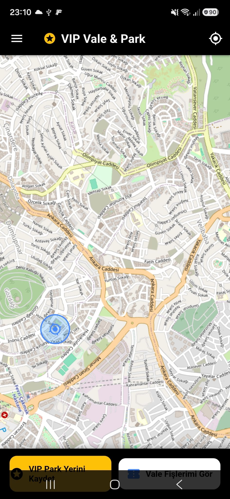
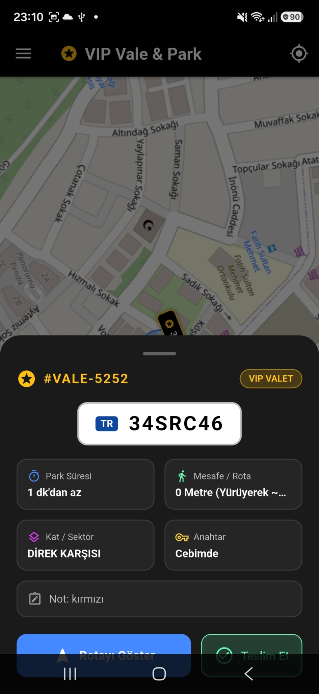
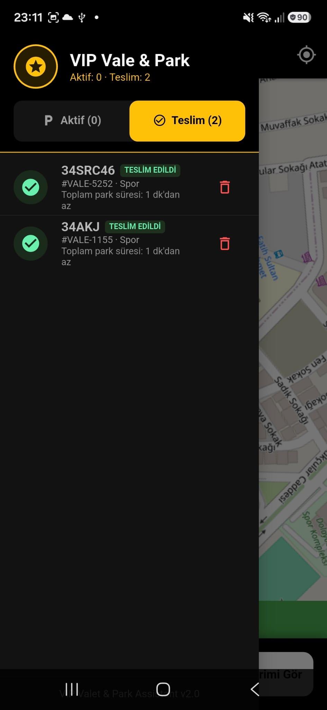
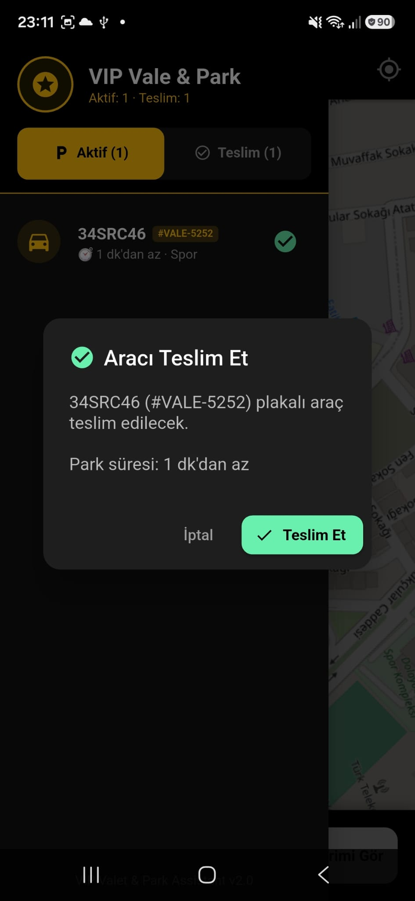

# [ VIP Vale & Park Asistanı ]

> Araç park yeri takibi, vale durum takibi ve teslimat süreçlerini yöneten mobil otomasyon sistemi.

[ Build: Passing ]  |  [ Platform: Flutter ]  |  [ Version: v2.0 ]

================================================================================

## [!] PROJE HAKKINDA

VIP Vale & Park, park edilen araçların konumunu, park sürelerini, araç detaylarını (anahtar durumu, sektör/kat, notlar) ve teslimat aşamalarını tek bir panel üzerinden takip etmeyi sağlayan mobil uygulamadır.

---

## [*] EKRAN GÖRÜNTÜLERİ

+-----------------------------------+-----------------------------------+
| 1. Canlı Harita & Konum           | 2. Araç & Vale Detay Kartı        |
+-----------------------------------+-----------------------------------+
|     |       |
+-----------------------------------+-----------------------------------+
| 3. Aktif & Teslim Edilen Araçlar  | 4. Araç Teslim Onayı              |
+-----------------------------------+-----------------------------------+
|       |     |
+-----------------------------------+-----------------------------------+

---

## [+] ÖNE ÇIKAN ÖZELLİKLER

-> Canlı Harita Entegrasyonu: Park yerini ve aracın bulunduğu konumu harita üzerinde anlık görüntüleme.
-> Detaylı Araç Durumu: Park süresi, sektör/kat bilgisi (ör: DİREK KARŞISI), araç notları ve anahtar lokasyonu ("Cebimde" vb.) takibi.
-> Gerçekçi Plaka Görünümü: Özel TR plaka formatında araç kimlik kartları ve vale takip kodları.
-> Aktif / Teslimat Takibi: Aktif park halindeki araçlar ile teslim edilmiş araçların sekme bazlı yönetimi.
-> Hızlı Teslimat Onayı: Park süresi özetini gösteren teslimat onay diyaloğu.

---

## [<>] TEKNOLOJİ YIĞINI

* Framework: Flutter (Dart)
* Harita Servisi: OpenStreetMap / Mapbox
* UI/UX: Dark Mode (Sarı / Yeşil Vurgulu Özel VIP Tema)

---

## [->] KURULUM VE ÇALIŞTIRMA

1. Repoyu bilgisayarınıza klonlayın:
   $ git clone https://github.com/nisss999/vale-otomasyon-sistem.git

2. Proje dizinine geçin:
   $ cd vale-otomasyon-sistem

3. Gerekli paketleri çekin:
   $ flutter pub get

4. Uygulamayı çalıştırın:
   $ flutter run

================================================================================
